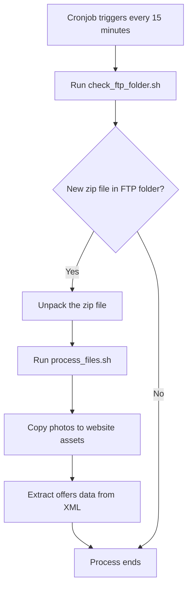
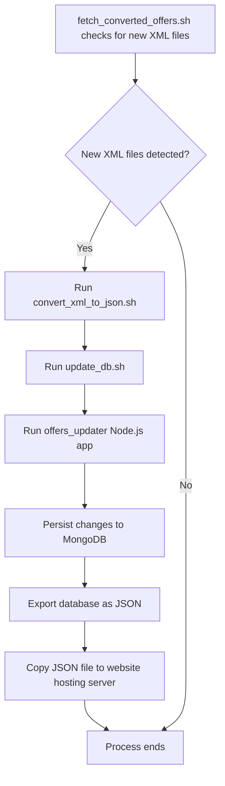

# Back-end processing incremental updates

There are 2 major infrastructure components involved in the process:
- website hosting server that also receives incremental updates over the FTP port.
- server hosting the Mongo DB instance

### Website hosting server

##### Receiving data updates from CRM

CRM system (Galactica Virgo) used by the real estate agency (Perfect House) to manage offers sends incremental updates
as zip files using FTP protocol. These zips contain XML file containing info on created/updated/deleted offers as well
as photos related to the created/updated offers.

A cronjob scheduled every 15 minutes runs `check_ftp_folder.sh`. If a new zip file is identified in the
FTP incoming folder, then it is unpacked and the `process_files.sh` script is getting triggered. It has the following
responsibilities:
- copy pictures to the website assets (the proximity to pictures storage is the main reason for this part of the
application being deployed to same server that hosts the website).
- extract created/updated and removed offers from the incoming xml file to a dedicated xml files.

### DB server

Every 15 minutes website hosting server is checked for new xml files by `fetch_converted_offers.sh` which is a
continuously running process. Once new files are detected, they are converted to json using `xq` in
`convert_xml_to_json.sh`. Then `update_db.sh` runs `offers_updater` node application which updates mongo db.
After persisting created/updated offers and removing the ones that were deleted, the whole database is exported
as a big json file which is then copied to the website hosting server.

Note: the db server architecture is currently undergoing a major rework. The goal is to have an API that will be the
only client of the db. API will be called during incremental updates and by the Angular front-end web application.

